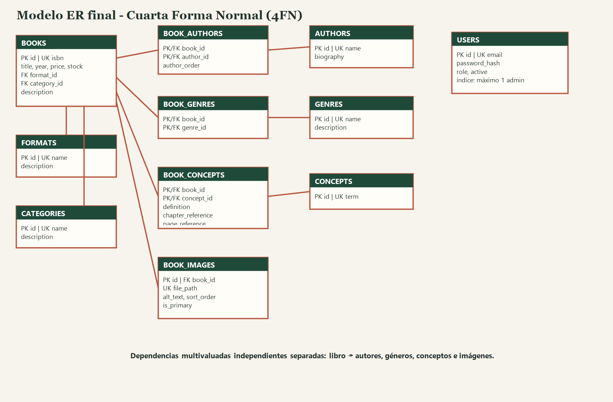

# Diseño ER y normalización hasta 4FN

## Dependencias identificadas

- `ISBN → título, año, precio, stock, formato, categoría, descripción`; ISBN es clave candidata de libro.
- `format_id → nombre, descripción` y `category_id → nombre, descripción`: catálogos independientes.
- `author_id → nombre, biografía`; libro ↔ autor es multivaluada (N:M).
- `genre_id → nombre, descripción`; libro ↔ género es multivaluada (N:M).
- `concept_id → término`, pero `(book_id, concept_id) → definition`: la definición depende de la obra y del concepto, no sólo del concepto.
- `book_id ↠ image`: un libro admite cero o muchas imágenes; cada imagen tiene ruta, orden, texto alternativo y condición de principal.
- `email → usuario`; un índice único parcial sobre el rol garantiza como máximo un administrador.

## De 1FN a 4FN

Autores, géneros, conceptos e imágenes no son columnas atómicas si se guardan como listas dentro de `books`: dificultan restricciones, búsquedas e índices, repiten información y causan anomalías de inserción, actualización y borrado. En 1FN cada celda contiene un valor. En 2FN los atributos de las tablas puente dependen de toda su clave compuesta. En 3FN/BCNF se separan formatos y categorías porque sus descripciones dependen del identificador del catálogo, no del libro. En 4FN se separa cada dependencia multivaluada independiente `libro ↠ autor`, `libro ↠ género`, `libro ↠ concepto` y `libro ↠ imagen`, evitando productos cartesianos y combinaciones espurias.

Las tablas puente `book_authors`, `book_genres` y `book_concepts` resuelven relaciones N:M. `book_concepts.definition` conserva la definición contextual: el mismo término puede significar algo distinto en dos libros. `book_images` es entidad dependiente con identificador propio porque cada imagen posee atributos.

## Diagrama

La demostración paso a paso está en `NORMALIZATION_4FN.md` y `NORMALIZATION_4FN.xlsx`. El DDL completo y sus restricciones están en `db/01_schema.sql`.
