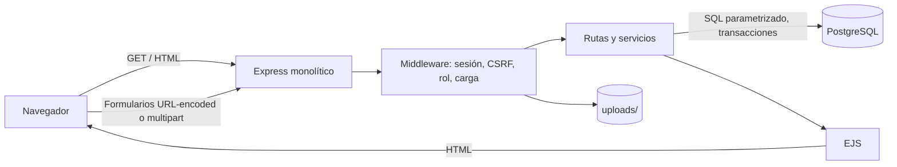

# Documentación de ingeniería

## Arquitectura

**Necesidad →** entregar HTML dinámico y formularios sin servicios web. **Decisión →** monolito modular Express + EJS + `pg`. **Justificación →** una única aplicación controla rutas, reglas, sesiones, vistas, archivos y SQL. **Ventajas →** despliegue y transacciones simples, menos superficie distribuida. **Limitaciones →** escalado conjunto y acoplamiento al esquema PostgreSQL.

La división en `routes/`, `services/`, `middleware/` y `views/` no crea servicios independientes: todos corren en el mismo proceso, comparten despliegue y sesión, y acceden a una misma base de datos. No hay API REST/GraphQL/SOAP; EJS produce HTML y los formularios envían datos tradicionales.

## Estructura antes de modificar

- `app.js`: composición del servidor, middleware, sesiones, rutas, errores y arranque.
- `config/db.js`: pool PostgreSQL, consulta común y helper transaccional.
- `middleware/auth.js`: identidad disponible en vistas, login obligatorio y rol administrador.
- `routes/`: controladores HTTP que reciben formularios y eligen vistas/redirecciones.
- `services/`: SQL y operaciones reutilizables; las escrituras compuestas usan transacciones.
- `views/`: plantillas EJS y parciales renderizados sólo en el servidor.
- `public/`: CSS e imágenes cargadas que Express sirve como archivos estáticos.

## Datos y funcionalidades

El diseño normalizado se explica en `DB_DESIGN.md`. Se implementan registro/login/logout; catálogo y detalle; búsqueda por título/ISBN; CRUD de libros, usuarios, autores, géneros, conceptos, formatos y categorías; administración de relaciones autor/libro y género/libro; definición contextual concepto/libro; y CRUD de imágenes desde el formulario de libro.

Flujo: navegador → ruta Express → validación/autorización → servicio → consulta parametrizada PostgreSQL → objeto interno → EJS → HTML. Después de una escritura se usa POST/Redirect/GET y mensajes flash, evitando reenvíos accidentales.

## Seguridad

**Necesidad →** proteger cuentas y operaciones privilegiadas. **Decisión →** bcrypt con coste 12, sesión opaca guardada en PostgreSQL, cookie `httpOnly`/`sameSite`, token CSRF y autorización centralizada. **Justificación →** la contraseña nunca se almacena en claro y las rutas administrativas verifican rol en servidor. **Ventajas →** controles coherentes y revocación de sesiones. **Limitaciones →** requiere HTTPS en producción y rotación segura de secretos.

El autorregistro fuerza rol regular. El índice parcial `ux_users_single_admin` impide una carrera que podría crear dos administradores. `postgres` sólo crea el usuario y la base durante el bootstrap. `library_app` es propietario de `online_library`, crea todos sus objetos y ejecuta el monolito; no es superusuario y conserva `NOCREATEDB`, `NOCREATEROLE` y `NOREPLICATION`, por lo que su capacidad de creación queda limitada a su propia base. Helmet añade cabeceras defensivas. Las consultas usan `$1…$n`; los nombres dinámicos de tablas/columnas sólo provienen de una lista cerrada del servidor. Los errores SQL esperados se traducen a mensajes; el detalle interno se registra, pero no se expone en errores 500.

## Validación, archivos y errores

HTML ofrece validación inmediata; servidor y restricciones PostgreSQL son la autoridad final. `CHECK`, `UNIQUE`, FK y tipos protegen integridad incluso fuera de la aplicación. Multer limita tamaño, MIME y extensiones JPG/PNG/WebP, genera nombres UUID y elimina el archivo si falla la inserción. El borrado de una imagen elimina registro y archivo; para producción conviene análisis de contenido/antivirus y almacenamiento de objetos.

## Despliegue en CentOS Stream 10, rendimiento y evolución

**Necesidad →** consultas eficientes y operación mantenible. **Decisión →** pool limitado, índices en búsqueda/uniones, transacciones cortas, vistas y módulos por responsabilidad. **Justificación →** reduce conexiones y mantiene invariantes en operaciones múltiples. **Ventajas →** buen desempeño para un catálogo académico/mediano y pruebas sencillas. **Limitaciones →** `ILIKE '%texto%'` no usa bien un B-tree; a escala se recomienda `pg_trgm`, paginación y caché.

Todo el ejercicio se despliega en una VM Compute Engine con CentOS Stream 10. Node escucha en `127.0.0.1:3000`, systemd administra el proceso y NGINX publica `/library`; SELinux permite únicamente la conexión del proxy hacia el upstream local. Con HTTPS se requiere `COOKIE_SECURE=true`, secretos fuera del repositorio, copias de seguridad y migraciones controladas. El monolito puede replicarse porque las sesiones están en PostgreSQL; las imágenes deben pasar a volumen compartido u objeto. Si el dominio crece, primero se separan módulos internamente.
